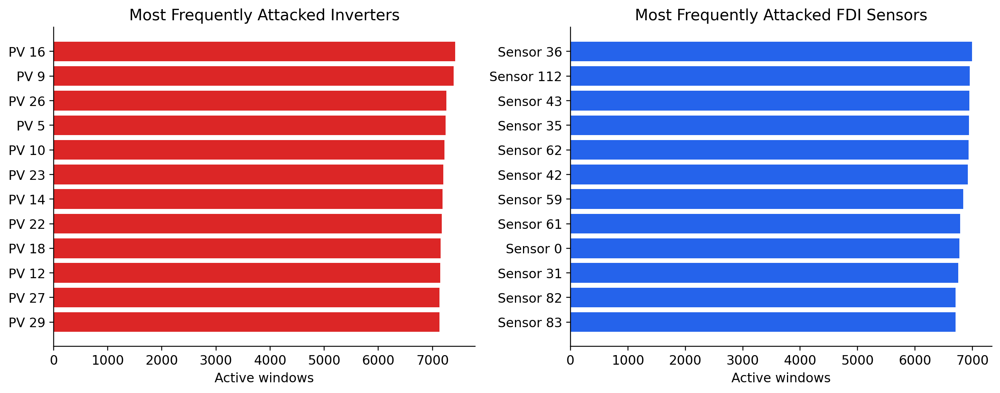
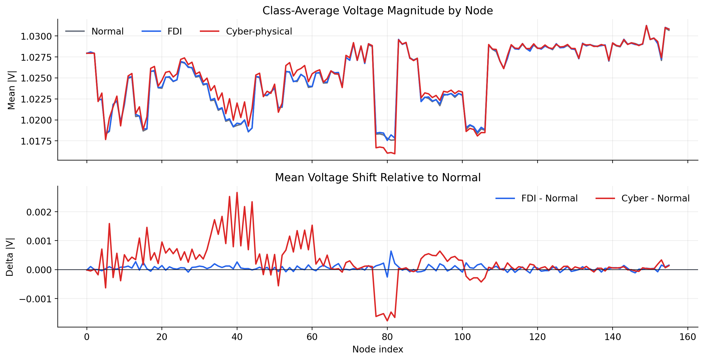

# Gated-Attention GCN for Smart-Grid Attack Detection

This folder contains the course-project version of a complete smart-grid cyber-attack detection pipeline: a boundary-stress dataset generator, and a complex-valued graph neural network with gated attention.

The simulator creates voltage-phasor windows from a SMART-DS-style distribution feeder, deliberately pushes the operating point near the volt-var deadband edge, injects false-data and cyber-physical attacks, and saves everything in a format that the model can train on directly.

## Project Idea

Modern distribution grids are no longer passive wires and transformers. They contain smart inverters, voltage controllers, phasor measurement units, and communication paths that can be attacked. This project focuses on three operating states:

| Label | Class | Meaning |
| --- | --- | --- |
| `0` | Normal | No attack; only ambient measurement noise and legitimate control behavior |
| `1` | FDI | False data injection corrupts reported phasor measurements |
| `2` | Cyber-physical | Smart-inverter control parameters are compromised |

The key difficulty is that FDI and cyber-physical attacks require different responses. If the detector confuses them, an operator may isolate healthy equipment or trust a compromised device. The model is therefore trained as a three-class classifier, not just a binary anomaly detector.

## The Boundary-Stress Dataset

The dataset generator in Attack_generation.py generates attacks on the SMART-DS dataset and add boundary-stress sampling.

Instead of keeping inverter voltages comfortably inside the volt-var deadband, the generator keeps the feeder near the lower deadband edge. Then it adds slow sinusoidal load perturbations so normal operation repeatedly crosses the controller threshold. This makes normal windows contain legitimate control transients, which are exactly the kind of events that can look suspicious to a weak detector.

That is the point of the dataset: make the normal class less boring, so the model has to learn the actual difference between normal control action, measurement corruption, and physical inverter manipulation.

## Model Story

The model is a complex-valued spatio-temporal GCN that adds the gated-attention mechanism described in the report.

The input is a complex voltage window:

```text
X: batch x nodes x time
   batch x 156 x 20
```

The backbone uses a complex graph convolution over the SMART-DS graph shift matrix. After the GCN produces a node-time-channel tensor, the attention module computes three gates:

| Gate | Axis | Role |
| --- | --- | --- |
| Node gate | Bus / node | Which locations in the feeder matter most |
| Time gate | Window step | Which moments in the 20-step window matter most |
| Channel gate | Feature channel | Which learned graph features matter most |

The three gates are combined as an outer product and applied with a residual identity factor:

```text
H_gated[n, t, c] = (1 + node_gate[n] * time_gate[t] * channel_gate[c]) * H[n, t, c]
```

That `1 + ...` matters. It means the module can emphasize useful features without erasing the backbone representation.

## Repository Map

```text
Course_Project/
├── data_generation.py              # Boundary-stress dataset generator
├── README.md                       # This project guide
└── Model/
    ├── data_utils.py               # Dataset loading, label mapping, splits
    ├── gated_attention_gcn.py      # Complex GCN + node/time/channel gate
    ├── layers.py                   # Complex-valued neural layers
    ├── models.py                   # Model entry points
    ├── train.py                    # Training and evaluation script
    ├── utility.py                  # Shared helpers
    ├── generate_presentation_plots.py
    └── README.md                   # Model-specific notes
```

The generated datasets and figures are stored one level up in:

```text
../Results_Course/
```

## Generated Dataset Files

After running the generator, the main files in `Results_Course` are:

| File | Shape | Meaning |
| --- | ---: | --- |
| `Vall_ReIm_boundary_stress.npy` | `(35040, 156, 20)` | Complex clean/stressed voltage windows |
| `VphasorFDI_boundary_stress.npy` | `(35040, 156, 20)` | Complex voltage windows with FDI effects |
| `attack_label_boundary_stress.npy` | `(35040, 30)` | Cyber-physical inverter attack labels |
| `AttackLabelFDI_boundary_stress.npy` | `(35040, 150)` | Combined physical + FDI label matrix |
| `Y_norm_sparse.npy` | `(156, 156)` | Complex graph shift / admittance-style matrix |
| `PhaseMatrix.npy` | varies | Phase availability matrix |
| `bus_phase_mapping.json` | JSON | Node-to-phase mapping metadata |
| `metadata_boundary_stress.npy` | dict | Generator configuration and bookkeeping |

The model loader reduces the raw attack labels into the three presentation classes: normal, FDI, and cyber-physical.


### Where Attacks Concentrate



This figure is useful because it makes the problem concrete. The red bars show which PV inverters are most often manipulated by the cyber-physical attack process. The blue bars show which measurement sensors are most often selected by the FDI process.

Attacks are spatially localized. A plain fully connected or recurrent model has to discover that locality from raw vectors, while a GCN starts with the feeder topology as a structural prior.

### How the Classes Differ Across the Feeder



This figure is a good bridge from the dataset to the model. The top panel compares class-average voltage magnitude by node. The bottom panel subtracts the normal profile and shows how much FDI and cyber-physical windows shift the voltage pattern.

The important detail is scale: many shifts are small, often around fractions of a percent. That is why the model needs both graph structure and attention. The signal is there, but it is scattered across nodes, time, and learned channels.

## Runbook

Run everything from the repository root:

```bash
cd /home/sa165267/Desktop/AttackJuly14_Paper
```

Generate the boundary-stress dataset:

```bash
python Course_Project/data_generation.py \
  --output-dir /home/sa165267/Desktop/AttackJuly14_Paper/Results_Course
```

Train the gated-attention GCN:

```bash
python Course_Project/Model/train.py \
  --data-dir /home/sa165267/Desktop/AttackJuly14_Paper/Results_Course \
  --output-dir /home/sa165267/Desktop/AttackJuly14_Paper/Results_Course/model_runs
```

The default training settings follow the report setup: 20 time steps, 156 nodes, Chebyshev order 6, two graph-convolution layers, 10 hidden channels, a 512-width fully connected layer, batch size 200, and Adam with learning rate `1e-4`.
